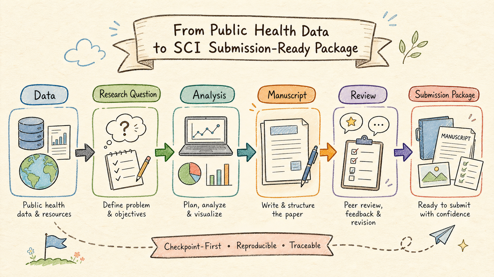
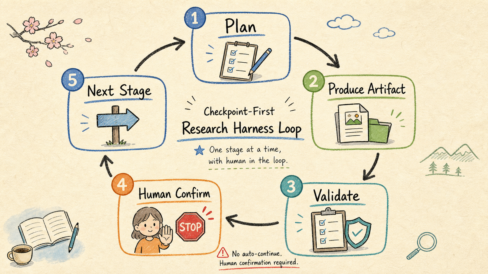
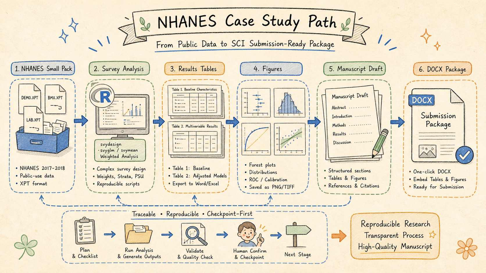

# 07. 教学课件讲义：用 ars-research-harness 讲 AI 医学科研工作流

这份讲义可以直接作为 90-120 分钟课程的讲课顺序。适用对象包括医学研究者、研究生、医院科研秘书、AI 培训学员和想把 AI 工作流工程化的开发者。

## 课程目标

讲完后，学员应该能理解三件事：

1. AI 写论文不能只靠 prompt，必须有分阶段工作流。
2. 医学公共数据分析需要可追溯的统计产物和引用核查。
3. Harness 的价值是把 AI 放进状态机、门禁和证据链里。

## 课件结构建议

| 时间 | 模块 | 讲什么 | 展示文件 |
|---:|---|---|---|
| 0-10 min | 开场 | 为什么普通 AI 写作容易越界 | `README.zh-CN.md` |
| 10-25 min | 总流程 | 数据如何走到投稿前包 | 图 1 |
| 25-40 min | Checkpoint | 为什么每阶段必须停下来确认 | 图 2 |
| 40-55 min | Harness 工程 | Skill、Workflow、State、Validator 的关系 | 图 3 |
| 55-75 min | NHANES 案例 | 小包数据如何变成表、图、Word | 图 4 |
| 75-95 min | S0-S9 拆解 | 每一步的目标、产物和禁区 | `docs/03-stage-by-stage.zh-CN.md` |
| 95-110 min | 实操演示 | 打开 workflow、checkpoint、submission package | `examples/` |
| 110-120 min | 迁移练习 | 如何替换成自己的数据 | `docs/04-replicate-with-your-data.zh-CN.md` |

## 图 1：Research-to-Paper Harness



讲解词：

这张图说明项目的总路线。左边是公共健康数据，右边不是直接的“论文”，而是经过研究问题、分析、稿件、审稿后形成的投稿前包。这里要强调“投稿前包”四个字：它包括正文、表、图、cover letter、STROBE mapping 和 readiness checklist，但不等同于期刊接收。

课堂提问：

- 如果跳过 Research Question，直接做 Analysis，会有什么风险？
- 如果跳过 Review，直接生成 Submission Package，会有什么风险？

## 图 2：Checkpoint-First Loop



讲解词：

这张图是本项目的核心控制逻辑。每一阶段必须产出 artifact，并且通过 validate 或人工检查。Human Confirm 不是礼貌性询问，而是工作流门禁。没有确认，就不能进入下一阶段。

课堂提问：

- AI 自动继续为什么危险？
- 哪些阶段最需要人工确认？

推荐强调：

- 研究问题确认前，不跑分析。
- 分析方案确认前，不写结果。
- 引用核查前，不声称投稿级。
- 审稿修回前，不生成最终包。

## 图 3：Academic Research Harness Architecture


讲解词：

这张图适合讲给工程背景学员。Skill Router 负责把任务分派到正确工作流，Workflow 定义阶段，Stage Contract 规定输入输出，State JSON 记录状态，Validator 做合规检查，Artifacts 是每一步留下的证据，Human Confirm 决定是否进入下一步。

课堂提问：

- 如果没有 State JSON，会发生什么？
- 如果没有 Validator，AI 会如何越级？
- 如果没有 Artifacts，如何审计结果？

## 图 4：NHANES Case Path



讲解词：

这张图进入案例实操。NHANES 小包数据首先进入 survey analysis，生成 Table 1/2 和 Figures，然后进入 Manuscript DOCX。这里要强调：数据分析、图表和 Word 稿不是三个孤立动作，而是一个可复刻流水线。

课堂演示：

1. 打开 `data/nhanes_2017_2018/README.md`，看数据来源。
2. 打开 `scripts/run_nhanes_analysis.R`，看分析入口。
3. 打开 `examples/nhanes-undiagnosed-diabetes/results/S8b/`，看表图。
4. 打开 `examples/nhanes-undiagnosed-diabetes/submission_package/manuscript_final_with_tables_figures.docx`，看最终交付。

## 实操脚本演示

```bash
python3 scripts/download_nhanes_small_pack.py
Rscript scripts/run_nhanes_analysis.R
python3 scripts/generate_tables.py
Rscript scripts/generate_figures.R
python3 scripts/build_submission_docx.py
python3 harness/scripts/validate_checkpoint_workflow.py examples/nhanes-undiagnosed-diabetes/workflow-run.json
```

讲解方式：

- 第一条命令：准备公共数据。
- 第二条命令：执行 survey 分析。
- 第三、四条命令：生成论文表和图。
- 第五条命令：把图表嵌入 Word。
- 第六条命令：验证 workflow 状态。

## 课堂练习

练习 1：让学员打开 `workflow-run.json`，找出当前阶段、已完成阶段数和最终报告路径。

练习 2：让学员打开 `checkpoints/stage-S3b-parsimonious-model.md`，说明为什么模型需要简化。

练习 3：让学员打开最终 Word，确认 Table 1、Table 2、Figure 1、Figure 2 是否已经嵌入。

练习 4：让学员设计自己的 S1 research question，但不允许直接进入 S3。

## 结尾总结

这套项目的核心价值不是“帮你省掉科研判断”，而是把科研判断显性化、阶段化、可检查化。AI 可以加速写作和整理，但每一个关键转折点都必须留下证据，并由人确认。
